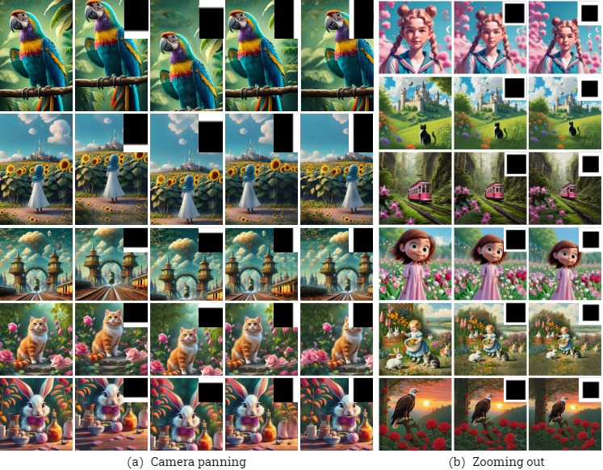
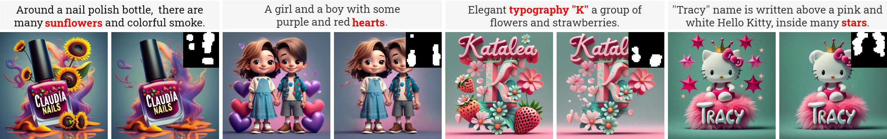
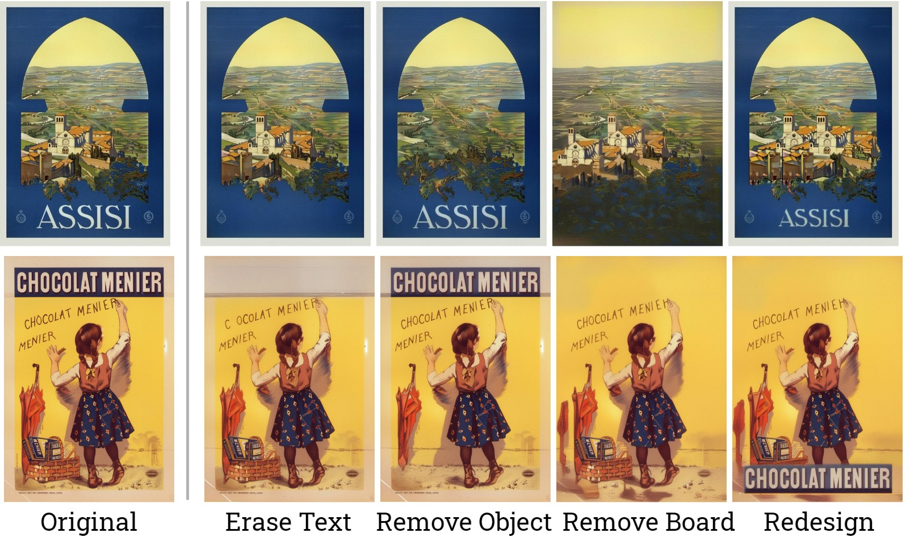

# DesignEdit: Multi-Layered Latent Decomposition and Fusion for Unified & Accurate Image Editing
> *Stable Diffusion XL 1.0* Implementation

### [Project Page](https://design-edit.github.io/)&ensp;&ensp;&ensp;[Paper](https://arxiv.org/abs/2403.14487)

The code will be released soon.

## Applications

### Object Removal

### Camera Panning and Zoom-Out

### Object Moving, Resizing, Flipping, and Repeating

### Typography Retype

### Decoration Removal with Cross-Attention Masks

### Cross-Image Composition

### Poster Editing

