# DesignEdit: Unify Spatial-Aware Image Editing via Training-free Inpainting with a Multi-Layered Latent Diffusion Framework
> *Stable Diffusion XL 1.0* Implementation


### [Project Page](https://design-edit.github.io/)&ensp;&ensp;&ensp;[Paper](https://arxiv.org/abs/2403.14487)&ensp;&ensp;&ensp;[Hugging Face Demo](https://huggingface.co/spaces/YuhuiYuan/DesignEdit)

## ✨ News ✨

- [2024/12/10] 🎉 DesignEdit has been accepted to AAAI 2025! 🎉
- [2024/4/4] We have supported the Gradio Application on Hugging Face 🤗, encouraging you to design online without the need for local deployment.
- [2024/3/28] We release the code for DesignEdit! Let's design together! 😍

## Setup

The required Python version is 3.10.12. , and the [Pytorch](https://pytorch.org/) version is 2.0.1.
The code's framework is built on [Prompt-to-prompt](https://github.com/google/prompt-to-prompt/) and  [Stable Diffusion](https://huggingface.co/stabilityai/stable-diffusion-xl-base-1.0).

Additional required packages are listed in the requirements file.
```bash
conda create -n DesignEdit python=3.10.12
conda activate DesignEdit
pip install -r requirements.txt
```
Notice that our model is entirely **training-free**💪!!! The base model is the Stable Diffusion XL-1.0.

## Demo
We have created an interactive interface using Gradio, as shown below. You only need to simply run the following command in the environment we previously set up:
```bash
python design_app.py
```
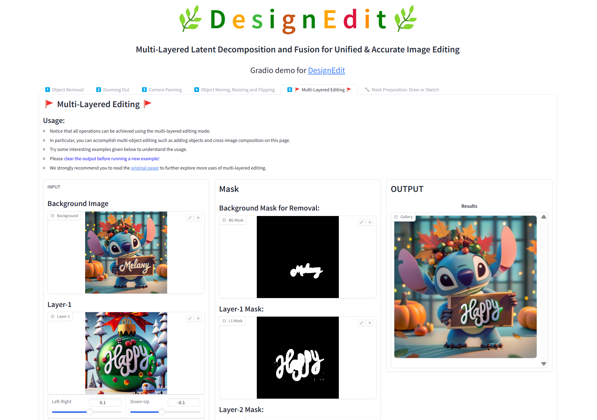

### 🖱️Usage

- We have 5 function pages for different editing operations.

💡**Object Removal**

💡**Zooming Out**

💡**Camera Panning**

💡**Object Moving, Resizing and Flipping**

💡**Multi-Layered Editing**  

- You can follow the "Usage" instructions within each page.  

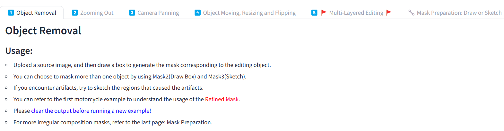  

- For each page, we also provide some interesting examples for you to try.  

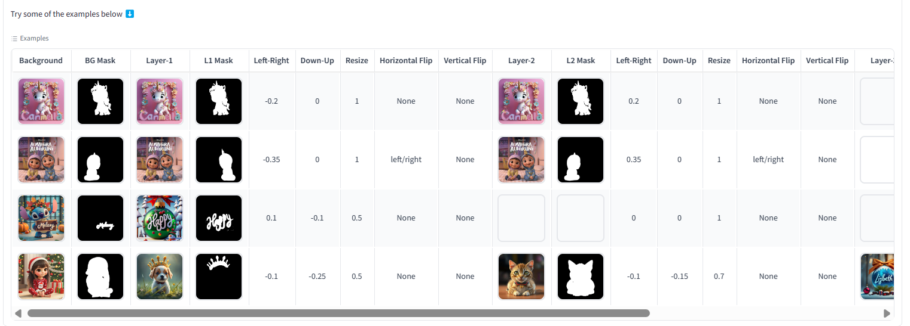  

- Notice that the **Multi-Layered Editing** page, which uses a multi-layered representation for multiple editing tasks, can achieve the same results as those of Object Removal and Object Moving, Resizing, and Flipping in a general representation.  

- Moreover, we have added the "Mask Preparation" page for you to utilize SAM or sketching to combine several masks together. This may be useful when you are on the **Multi-Layered Editing** page.  

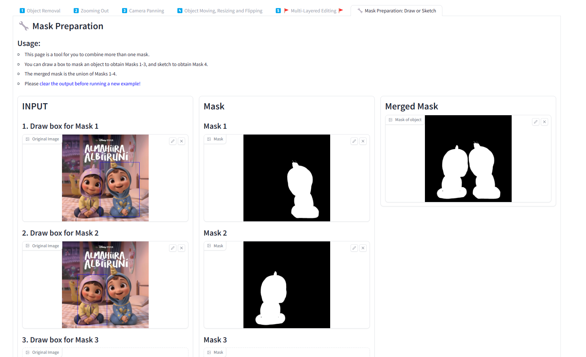

## More Details  

If you are interested in exploring more details about the model implementation, we recommend checking out [`model.py`](design_copy/src/demo/model.py). Pay special attention to the `register_attention_control()` function and the `LayerFusion` class.  


## Applications  

For more applications, we kindly invite you to explore our [project page](https://design-edit.github.io/) and refer to our [paper](https://arxiv.org/abs/2403.14487).

### 💡Object Removal  

You can choose more than one object to remove on the **Object Removal** page, and it is also possible to mask irregular regions for removal.

<div align="center">
    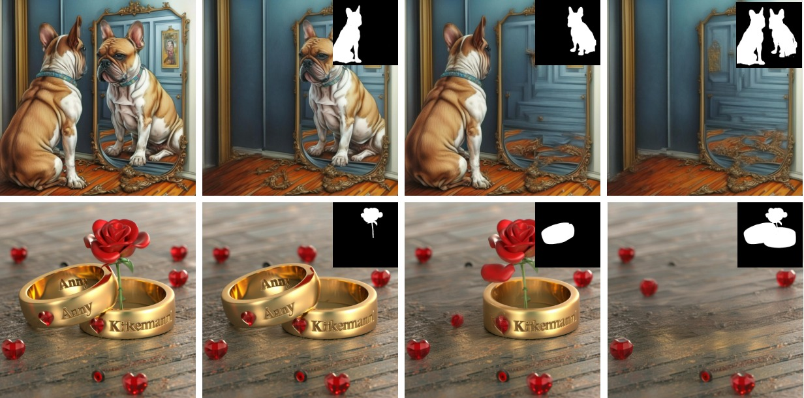
</div>

### 💡Object Removal with <span style="color:red;">Refine Mask</span>  

Using remove mask directly may cause artifacts, the refine mask indicates regions that may cause artifacts. You can turn to **Object Removal** page to explore.  

<div align="center">
    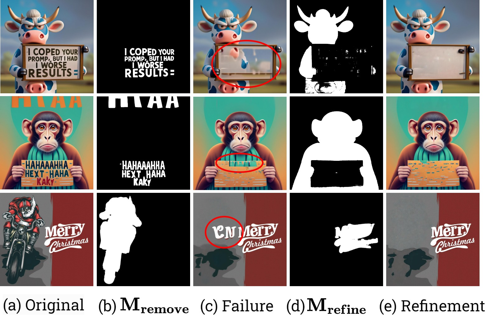
</div>

### 💡Camera Panning and Zooming Out  

You can use the **Camera Panning** and **Zooming Out** page to achieve editing with different scales and directions.

<div align="center">
    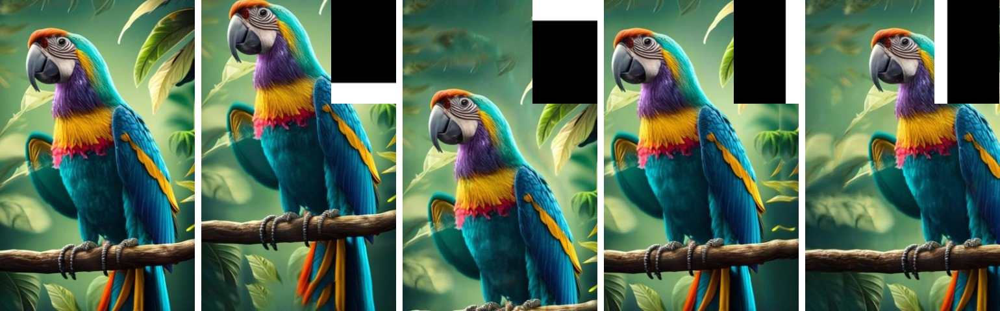
</div>
<div align="center">
    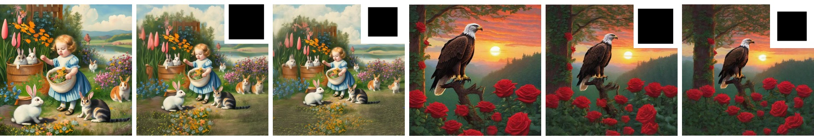
</div>

The illustration of image adjustment and mask preparation is shown below.  

<div align="center">
    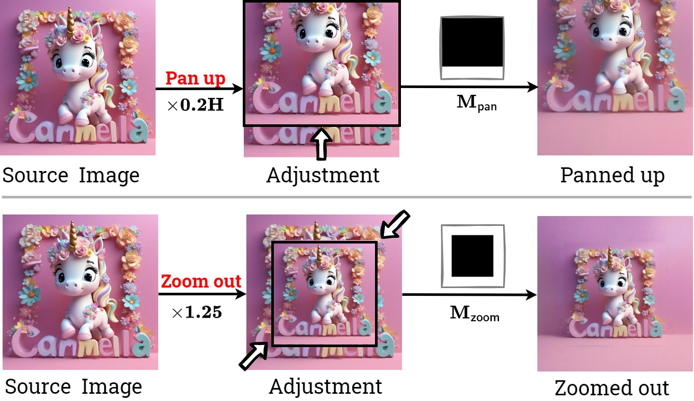
</div>

### 💡Multi-Object Editing with Moving, Resizing, Flipping

You can achieve single object moving, resizing, flipping in **Object Moving, Resizing and Flipping** page, 
for multi-object editing like swapping and addition, you can turn to **Multi-Layered Editing** page.  

<div align="center">
    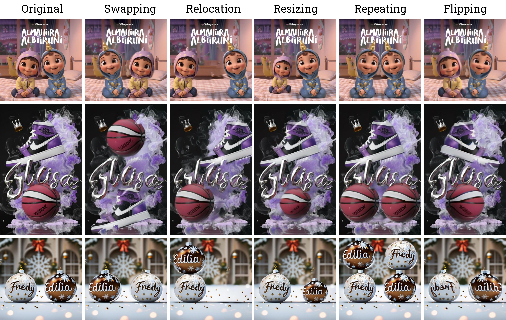
</div>

### 💡Cross-Image Composition  

By choosing one image as the background and specifying the position, size, and placement order of the foreground images, we can achieve cross-image composition. You can try examples on the **Multi-Layered Editing** page.

<div align="center">
    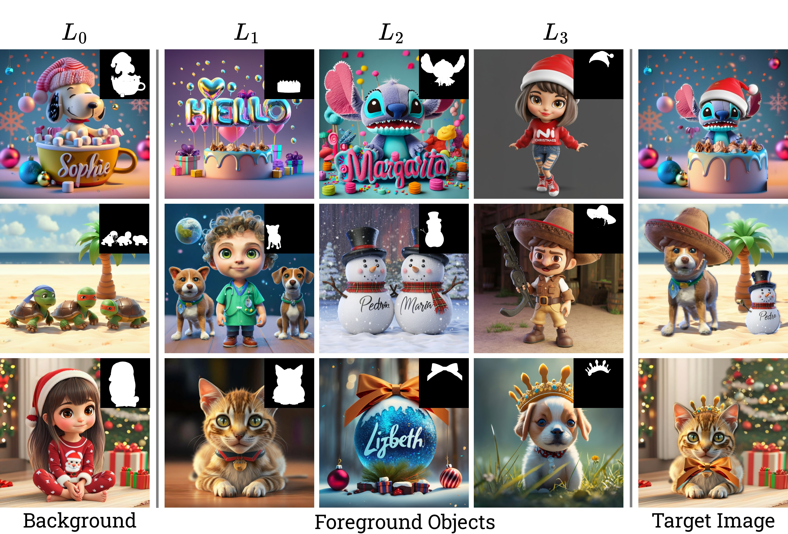
</div>

### 💡Typography Retyping  

Typography retyping refers to the specific use of design elements, which you can achieve on the **Multi-Layered Editing** page.  

<div align="center">
    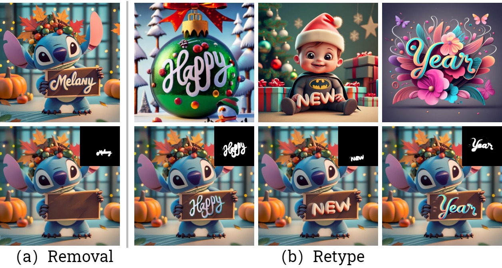
</div>

## Acknowledgements  

Our project benefits from the contributions of several outstanding projects and techniques. We express our gratitude to:

- [**Prompt-to-Prompt**](https://github.com/google/prompt-to-prompt.git): For innovative approaches in prompt engineering. 

- [**Proximal-Guidance**](https://github.com/phymhan/prompt-to-prompt.git): For their cutting-edge inversion technique, significantly improving our model's performance. 

- [**DragonDiffusion**](https://github.com/MC-E/DragonDiffusion.git): For inspiration on Gradio interface and efficient SAM API integration.

Each of these projects has played a crucial role in the development of our work. We thank their contributors for sharing their expertise and resources with the community.

## BibTeX

```bibtex
@misc{jia2024designedit,
  title={DesignEdit: Multi-Layered Latent Decomposition and Fusion for Unified & Accurate Image Editing},
  author={Yueru Jia and Yuhui Yuan and Aosong Cheng and Chuke Wang and Ji Li and Huizhu Jia and Shanghang Zhang},
  year={2024},
  eprint={2403.14487},
  archivePrefix={arXiv},
  primaryClass={cs.CV}
}
```


